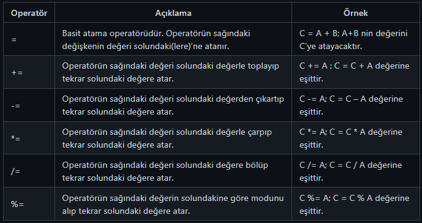

# Temel Operatörler
Java dilinde operatörler birçok işlemi yapabilmenize olanak tanır. Örneğin: matematiksel operatörlerle birlikte aritmetik işlemler yapabilmenizi, ilişkisel operatörlerle verileri kıyaslayabilmeyi, atama operatörleri ile değişkenlerin değerlerini değiştirmeye fırsat verir.

Java'da operatörler aşağıdaki gibi listelenebilir:

- Atama Operatörleri
- Aritmetiksel Operatörler
- İlişkisel ve Eşitlik Operatörler
- Koşul Operatörler
- Mantıksal Operatörler
- Atama Operatörü


## Aritmetik Operatörler
Java'da Aritmetik Operatörler adından da anlaşılacağı üzere matematiksel işlemleri programlama dilinde uygulamamızı sağlarlar.

Toplama : a + b
Çıkarma : a – b
Çarpma : a * b
Bölme : a / b
Mod alma : a % b
1 arttırma : a++
1 eksiltme : b--

## Karşılaştırma Operatörleri
Java'da Karşılaştırma Operatörleri iki nesnenin birbirleriyle olan durumlarını belirler.

Eşitlik : a == b
Eşit Değil : a != b
Büyüktür : a > b
Küçüktür : a < b
Büyük Eşittir : a >= b
Küçük Eşittir : a <= b

## Mantıksal Operatörler
Java'da Mantıksal Operatörler , nesnelerin veya ifadelerin mantıksal değerlerini yansıtır.

Ve : a && b
Veya : a || b
Değil : !(a&&b)

## Koşul Operatörü
Java'da Koşul Operatörleri ifadelerin sonucunda oluşacak olayları belirler.
```java
a = 5 ;
b = (a == 1) ? 1 : 0
Çıktısı : 0
```